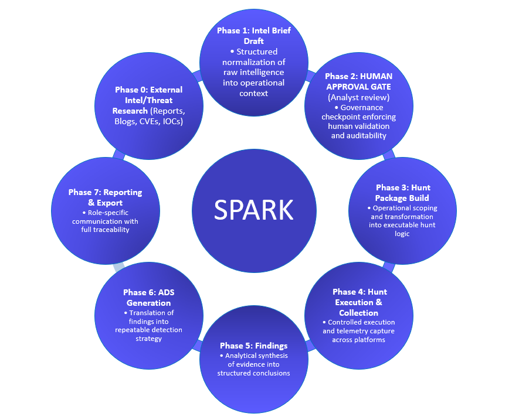

  

---

# SPARK — Security Playbook for Analytics, Research, and Knowledge
*(Powered by BYO-SECAI)*

**SPARK (Security Playbook for Analytics, Research, and Knowledge)** is an analyst-driven, open-source platform that applies AI as an **augmentation layer** to transform threat intelligence into executable threat hunts, findings, and detection strategies — end to end.

SPARK is built for threat hunters, detection engineers, and incident responders who want to move faster **without sacrificing transparency, control, or judgment**.

---

## Live Demo (Simulation Mode)

SPARK includes a **Simulation Mode** designed for guided walkthroughs and exploration without requiring local resources or live telemetry.

This mode allows users to:
- Walk through the full **Intel → Hunt → Run → Findings → ADS** lifecycle
- Adjust parameters and see how outputs change
- Explore a grounded **Workspace chat experience**

For full functionality (local RAG ingestion, persistent workspace state, and real processing), run SPARK locally.

---

## Why SPARK Exists

Threat intelligence is abundant — but operational outcomes are not.

Security teams routinely collect reports, advisories, and indicators, yet the translation from **intelligence → hunt → finding → detection** is often manual, inconsistent, and lost over time. Context fades, assumptions disappear, and detections become disconnected from the intelligence that justified them.

SPARK exists to close this gap by preserving **analyst reasoning, traceability, and intent** while using AI to reduce mechanical effort — **not replace judgment**.

**AI in SPARK is RAG-based and content-agnostic:** no bundled corpus, no internet inference — only analyst-provided knowledge.

---

## Threat Hunting Philosophy

SPARK is built on a practitioner-driven threat hunting philosophy that emphasizes behavioral analysis, hypothesis-driven hunts, and durable detection outcomes.

Rather than focusing on alerts or IOCs alone, SPARK is designed to support hunting *in the gaps* — where advanced threats operate.

See [`docs/01_concepts/threat-hunting-philosophy.md`](docs/01_concepts/threat-hunting-philosophy.md) for details.

For a deeper explanation of how SPARK defines and operationalizes intelligence, see  
[`Operational Threat Intelligence`](docs/01_concepts/operational-threat-intelligence.md).

---

## What SPARK Is (and Is Not)

### SPARK **is**:
- **Analyst-driven and review-first** — human judgment is the final word
- **AI-augmented, not AI-authoritative** — AI assists; it does not decide
- **Traceable** — every detection links back to the originating intelligence
- **Local-first** — designed for auditability and privacy

### SPARK **is not**:
- An autonomous SOC or alerting engine
- A black-box AI decision system
- An IOC-only detection platform
- A replacement for analyst expertise

SPARK uses opinionated terminology to preserve analytical intent and traceability.  
See [`Terminology`](docs/01_concepts/terminology.md) for definitions used throughout the project.

---

## Documentation

- 📘 [Concepts & Philosophy](docs/01_concepts/)
- 🧠 [Architecture & Design](docs/architecture/)
- 🧩 [Templates](docs/templates/)
- 🚀 [Demo & Examples](docs/demo/)
- 🔧 [Setup & Configuration](docs/setup/)
- 🔐 [Security](SECURITY.md)
- 🗺️ [Roadmap](ROADMAP.md)

---

## How SPARK Works

SPARK operationalizes threat intelligence through a structured, analyst-driven lifecycle that transforms raw research into validated detections.

  

Each phase is designed to preserve context, enforce validation, and maintain auditability.

---

## Retrieval-Augmented Generation (RAG) Model

SPARK uses a **Retrieval-Augmented Generation (RAG)** approach to ensure AI assistance is grounded in analyst-provided context.

### What This Means

AI suggestions in SPARK are generated exclusively from **locally available, analyst-approved artifacts**, such as Intel Briefs, Hunt Packages, Findings, Detection Strategy documents, and other user-ingested materials.

SPARK **does not ship with a pre-loaded knowledge base** and does **not rely on general internet knowledge** to infer detections or generate content. The quality and relevance of AI output is directly tied to the content you choose to provide.

### Why This Matters

- **Reduces hallucinations** — AI stays within reviewable bounds  
- **Preserves intent** — outputs remain explainable and analyst-owned  
- **Repeatable** — consistent hunt and detection development  
- **Environment-specific** — reflects *your* telemetry and priorities  

### Content Responsibility (Bring Your Own Knowledge)

SPARK is intentionally content-agnostic. Users are expected to ingest their own material, including internal documentation, public threat reports, detection repositories, or open-source hunting resources.

> **Note:** SPARK may recommend open-source intelligence or detection repositories as optional starter material, but all ingestion is user-initiated and user-controlled.

For guidance on sourcing and organizing RAG content, see  
[`docs/getting-started/rag-starter-content.md`](docs/getting-started/rag-starter-content.md)

---

## Analyst Workspace

SPARK provides a persistent **Analyst Workspace** that acts as connective tissue between intelligence, hunts, findings, and detections.

Think of the **Notebook Workspace** as a threat intelligence notebook that captures analytical reasoning, decisions, and assumptions over time.

SPARK includes:
- A **chat-first Notebook Workspace** for exploratory analysis
- A **Platform Workspace model** governing artifact lifecycle and promotion

### Workspace Flow (High Level)

